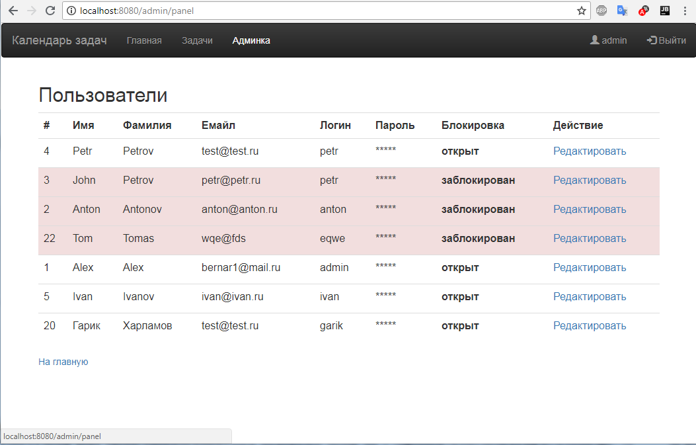

Calendar of Tasks application allows users to plan tasks and manage their time. Tasks are divided into main categories: home, family, work, other. A task can have a list of subtasks. When the task is completed, the user marks specific task is "Done". The following technologies were used in the development: Java, JDBC, JPA, JSP,  XML, JAXB, Spring (Core, MVC, Security, Data), Hibernate, Tomcat.

Окно главной страницы:

Окно Задачи, выбрана вкладка Семейные:

Окно администратора:

Сценарии использования формализованы в Use-Case диаграмме:

